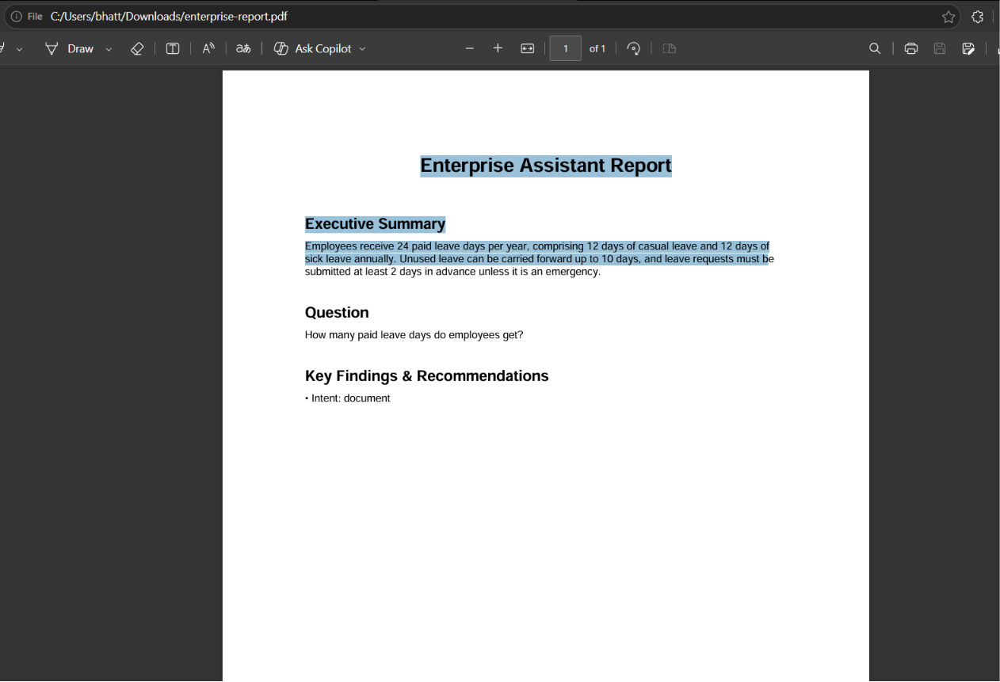
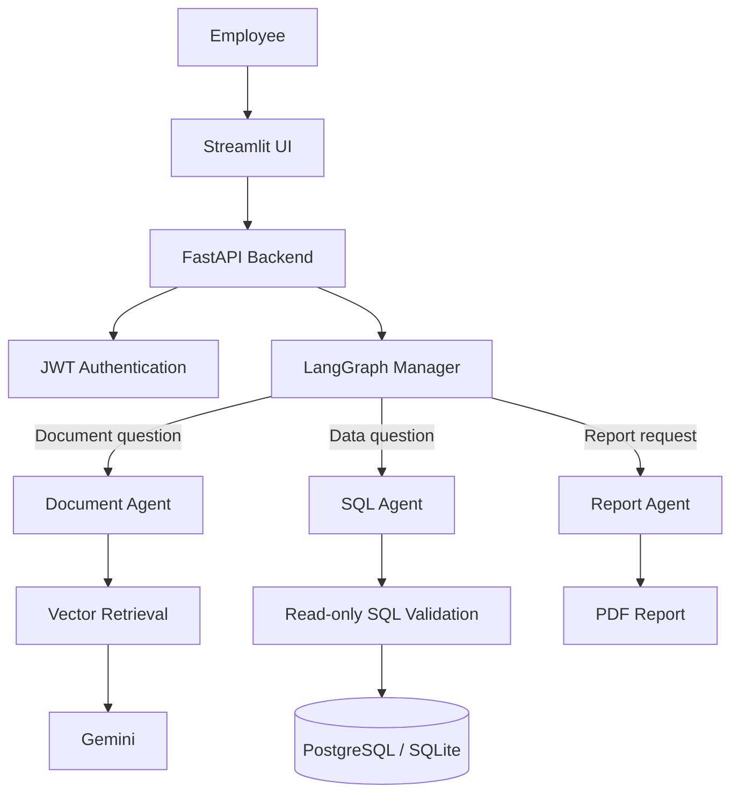

# 🚀 Enterprise AI Assistant

> An AI-powered enterprise knowledge assistant that lets teams ask questions over their documents, run safe natural-language analytics, and generate executive PDF reports.


## Why it matters

Company knowledge is often scattered across policies, contracts, and business systems. Enterprise AI Assistant gives employees one secure interface to retrieve document-backed answers, query approved business data, and turn findings into shareable reports—without exposing raw SQL or requiring users to know where information lives.

## ✨ Features

- Multi-agent routing with LangGraph
- Retrieval-Augmented Generation (RAG) over uploaded documents
- PDF, DOCX, and TXT extraction, chunking, and indexing
- Gemini-generated, document-grounded natural-language answers
- Source citations with document, page, and similarity score
- Natural-language-to-SQL analytics with read-only SQL guardrails
- JWT authentication and employee/admin roles
- Per-user conversation history and document isolation
- Executive PDF report generation
- PostgreSQL-ready persistence, with SQLite for local development
- Docker Compose setup for a reproducible stack

## 📸 Screenshots

### Generated PDF Report



Additional product screenshots can be added to `docs/images/` using the same pattern.

## 🛠 Tech Stack

| Layer | Technologies |
| --- | --- |
| Frontend | Streamlit |
| Backend | FastAPI, Pydantic, SQLAlchemy |
| Agent orchestration | LangGraph |
| AI | Google Gemini API; local deterministic fallback for no-key development |
| Retrieval | FAISS-ready vector layer with a persisted local index fallback |
| Data | PostgreSQL for production; SQLite for development |
| Security | JWT, bcrypt password hashing, role checks, read-only SQL validation |
| Reporting & deployment | ReportLab, Docker, Docker Compose |

## Architecture



## 💬 Example Questions

- “How many paid leave days do employees get?”
- “What is our refund policy?”
- “Summarize this contract’s termination conditions.”
- “Show total sales by region.”
- “Generate an executive report from the latest sales findings.”

## Quick Start

### Prerequisites

- Python 3.11+
- A Google Gemini API key for AI-generated answers (optional for local API/UI exploration)
- PostgreSQL (optional; SQLite is the default)

### Run locally

1. Install dependencies:

   ```bash
   pip install -r requirements.txt
   ```

2. Set configuration in `.env`:

   ```env
   JWT_SECRET=replace-with-a-long-random-secret
   GEMINI_API_KEY=your_gemini_api_key
   GEMINI_MODEL=gemini-2.5-flash
   ```

3. Start the API:

   ```bash
   uvicorn backend.main:app --reload --port 8000
   ```

4. In a second terminal, start the UI:

   ```bash
   streamlit run app.py
   ```

Open `http://localhost:8501`, register an account, upload a document, and ask a question. Interactive OpenAPI documentation is available at `http://localhost:8000/docs`.

## Docker

```bash
docker compose up --build
```

The UI is available at `http://localhost:8501`; the API and OpenAPI docs are available at `http://localhost:8000` and `http://localhost:8000/docs`.

## 🌍 Live Demo

Update these links after deployment:

- Frontend: `https://enterprise-ai-assistant-8z3g6yvmrkdsr7zkmwbep9.streamlit.app/`
- Backend API: `https://enterprise-ai-assistant-pxc4.onrender.com/`
- API docs: `https://enterprise-ai-assistant-pxc4.onrender.com/docs`

## API Overview

| Method | Endpoint | Purpose |
| --- | --- | --- |
| POST | `/api/auth/register` | Create an employee account |
| POST | `/api/auth/login` | Receive a bearer token |
| POST | `/api/documents/upload` | Upload and index a document |
| POST | `/api/chat` | Route a question through the agent workflow |
| POST | `/api/reports` | Generate a PDF report |
| GET | `/api/history` | Get the authenticated user’s conversation history |
| GET | `/api/reports/{id}/download` | Download a report |

## 🧠 Design Decisions

- **Specialized agents:** LangGraph makes routing explicit and keeps document, SQL, and reporting responsibilities separate.
- **Grounded responses:** RAG retrieves only the user’s own indexed chunks; Gemini receives those chunks as context and answers with citations returned separately.
- **Safe analytics:** the SQL agent only permits a single `SELECT`/`WITH … SELECT` statement, blocks mutation/DDL keywords, and adds a row limit. Production deployments should also use a read-only database account.
- **Practical local development:** SQLite and a local persisted vector fallback let the app run without provisioning cloud infrastructure. PostgreSQL, Gemini, and FAISS integration points are retained for production.
- **Defensible security boundary:** authentication, upload validation, user-scoped retrieval, secrets in `.env`, and server-side report ownership checks are implemented at the API layer.

## 🚀 Roadmap

- [ ] Hybrid retrieval (BM25 + vector) and reranking
- [ ] Multi-document comparison
- [ ] Role-based analytics dashboards
- [ ] Redis query caching and asynchronous indexing workers
- [ ] Voice interface
- [ ] Observability with traces, metrics, and audit logs
- [ ] Kubernetes deployment manifests and CI/CD pipeline

## Testing

```bash
pytest -q
```

Tests cover SQL write-blocking, chunking behavior, and user-scoped retrieval. See [architecture notes](docs/architecture.md) for production hardening and deployment considerations.

## License

Distributed under the [MIT License](LICENSE).
